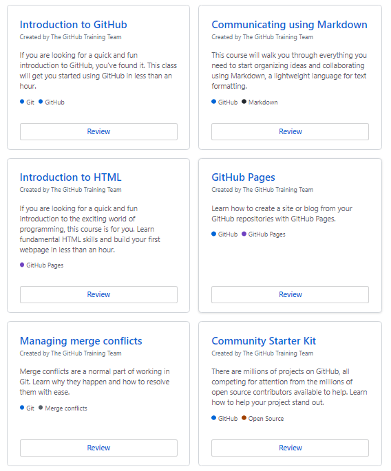
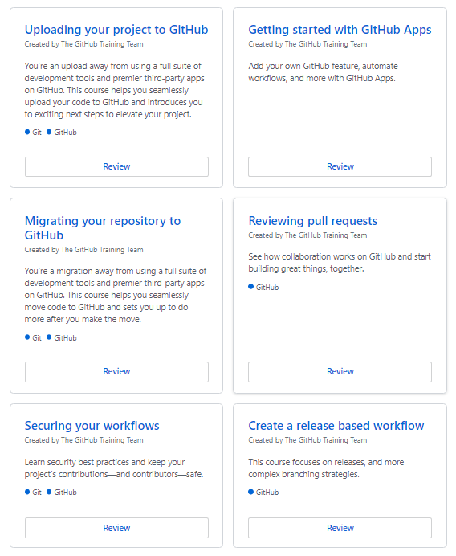
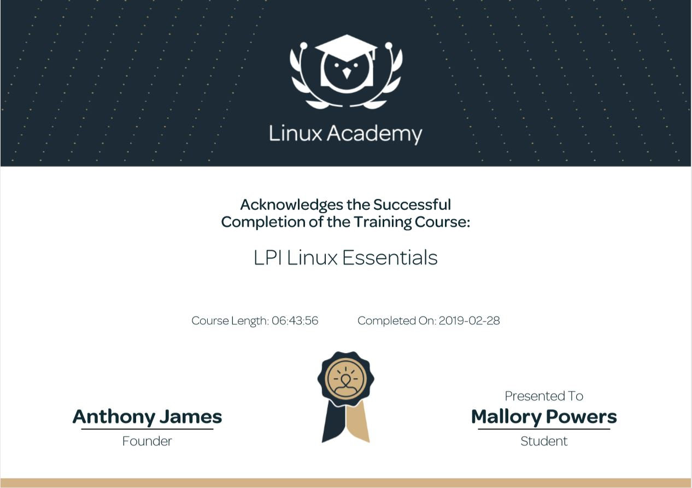

# Resume
## Techical Skills and Certifications Resume

Below are different technical skills and certifications that I have worked with and gained knowledge on. A brief description and proof of completion / training can be accessed by clicking the drop-down arrows under each skill heading.

## Technical Skills

GitHub

<h4> Description </h4>
GitHub training modules on lab.github.com/courses allow for individuals to learn about the different features GitHub has. By completing these training modules, I have gained knowledge on markdown, managing projects in GitHub, and creating GitHub Apps.
The modules are listed below:
  <ul>
    <li>Introduction to GitHub</li>
    <li>Communicating using Markdown</li>
    <li>Introduction to HTML</li>
    <li>GitHub Pages</li>
    <li>Managing merge conflicts</li>
    <li>Community Starter Kit</li>
    <li>Uploading Your Project to GitHub</li>
    <li>Getting Started with GitHub Apps</li>
    <li>Migrating Your Repository to GitHub</li>
    <li>Reviewing Pull Requests</li>
    <li>Securing Your Workflows</li>
    <li>Create a Release Based Workflow</li>
    <li>Introduction to Github</li>
  </ul>
  
 
    
Completition Documents:

      
      
  

 

Linux

<h4> Description </h4>
Linux Academy's LPI linux essentials course covers all the objectives that are listed by LPI for the linux essentials certification.
By completing this course I have gained knowledge on the history and development of linux, command line basics for linux, and creating users and files.  
  
 
    
Completition Documents:

        
  

 
  

Power BI

<h4> Description </h4>
Add power BI description here
  
  
 
    
Completition Documents:

    <iframe src=https://powersma00.github.io/Resume/powerbi_edX.pdf &embedded=true" style="width:100%; height:100%;" frameborder="0"></iframe>
                                                                                                                                     
        Resume/powerbi_edX.pdf
      
   

  
 
  

PowerShell

<h4> Description </h4>
add powershell training description here

 

Amazon Web Services (AWS)

<h4> Description </h4>
add aws description here

  
 

## Certifications

CSX Security Fundamentals

<h4>Description</h4>
Security fundamentals description

 

COMPTIA Security +

  <h4>Description</h4>
Testout studying, book, etc. w/test date

 

